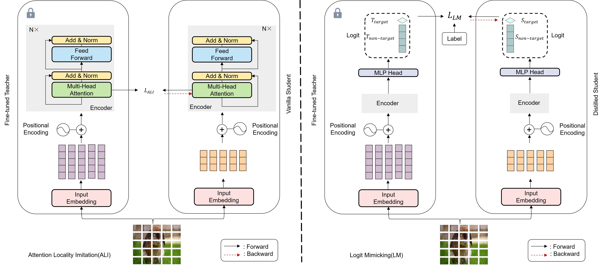

# CIKD

<p align="center">

</p>


This is the official PyTorch repository for Patient Teacher can Impart Locality to Improve Lightweight Vision
Transformer on Small Dataset.


* This repo is a modification on the [MAE repo](https://github.com/facebookresearch/mae). Installation and preparation follow that repo.

* The teacher models in this repo are called from [Huggingface](https://huggingface.co/). Please install transformers package by running: <br> `pip install transformers`.

## In the first stage:Attention Locality Imitation(ALI) 


```
python ALI_cifar100.py --batch_size 256 --model vit_tiny_patch16 --epochs 300 --warmup_epochs 15 --weight_decay 0.05 --teacher_model mae_vit_base
```


## In the second stage：Logit Mimicking(LM)


```
python LM_cifar100.py --batch_size 512 --model vit_tiny_patch16 --epochs 300 --warmup_epochs 15 --weight_decay 0.05 --teacher_model mae_vit_base
```

Get our  checkpoints from [here](https://drive.google.com/drive/folders/1BVNNKwb8lhdSULLM1_jVr7ufMAqkVJAo?usp=drive_link).